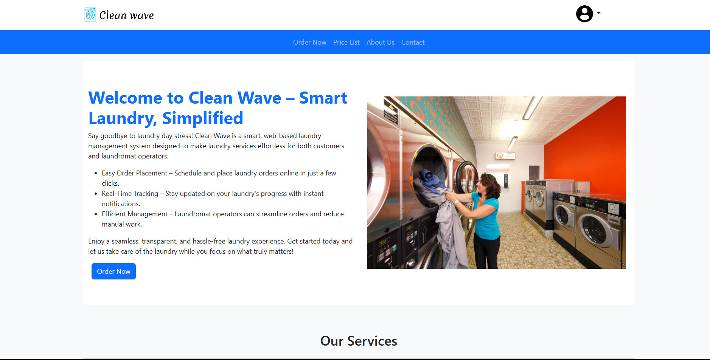

# Hi there, I'm Ian Gitonga! 👋

## About Me 🚀

I'm a passionate **junior backend developer** with experience in **Python and JavaScript**. I love tackling complex problems, learning new skills, and collaborating with diverse teams to create innovative solutions.

- 🌱 Currently learning: **Data exploration and visualization**
- 🔭 Working on: **Predictive analysis using linear models**
- 🌍 Languages: **Python, JavaScript**
- 📫 How to reach me: **gitonga.ik@gmail.com**
- ⚡ Fun fact: **Certified Cinephile💥**

## My Skills 🧠

## Featured Projects 💻

### [Cleanwave](https://github.com/gitonga-ik/cleanwave)

**Cleanwave** is a **laundromat management system** built with **Node.js**. This project demonstrates my ability to **implement a robust backend system that improves workplace productivity in laundromats**. You can check out the repository [cleanwave](https://github.com/gitonga-ik/cleanwave).

## Get in Touch 📬

- **Personal Website** - [Ian Gitonga](https://bit.ly/IanGitonga)
- **LinkedIn** - [Ian Gitonga](www.linkedin.com/in/gitonga-ian)
- **Twitter** - [Ian Gitonga](https://x.com/iannoh34)

 
